# Tmux: multitask, keep stuff running

tmux (Terminal Multiplexer) is a shell app that lets you have multiple
command line windows and tabs open at a time. The two biggest reasons
why you should use tmux:

\- Save your place and come back to it next time

\- Run multiple commands at the same time. For example, lookup a
command's manpage in one pane (part of a window), and execute the
command in the other.

#### Basic usage

When you first log into the Linux server, check for an existing tmux
session and attach to it.

```
$ tmux a
```

This is like opening up your web browser, and choosing to Restore your
previously open tabs. That way you don't open multiple tmux sessions
when one was already there and you forgot about it

If there are no sessions, start a new one.

```
$ tmux
```

You're in tmux when you see a green bar at the bottom of your terminal
window.

The bottom green bar shows us this is tmux session zero \[0\] with one
window (tab) open, 0:bash. The asterisk (\*) shows we are viewing that
tab.

To close tmux, exit out of each window and pane.

```
$ exit
```

#### Multiple windows (like browser tabs)

Multiple tmux windows work just like browsers tabs.

[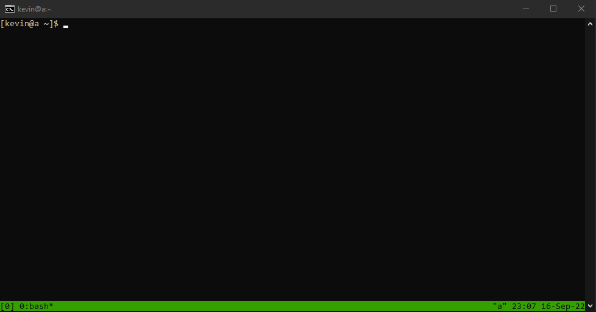](img/tmux.png)

tmux can have multiple tabs too.

[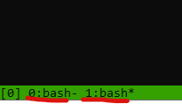](img/tmux0.png)

Each tab is called a window. The terms are important if you read the
tmux manpage, the authoritative source on how tmux works.

**All tmux commands begin with a prefix key: Control-b by default.**

Open a new tmux session, or attach to an existing session, as
explained in the section above.

Create a new tmux window (tab).

```
Ctrl-b c
```

[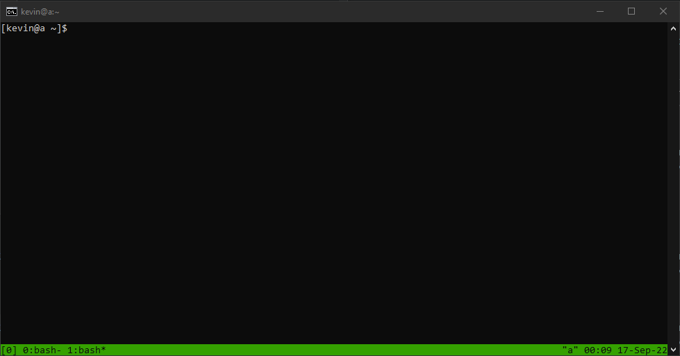](img/tmux1.png)

Notice on the bottom green bar there is a new tab: 1:bash. The star \*
shows we are viewing the new tab.

Tabs are listed in the bottom left of the terminal, in the green
bar. In the first screenshot above, only one tmux tab was open: 0:bash

The name 'bash' in the tab will change if you run some types of
commands.

Edit a new file with vi(1). Or you can use nano(1). I chose vi this
time because it doesn't have as much text at the bottom of the screen
as nano for this example.

```
$ vi test
```

[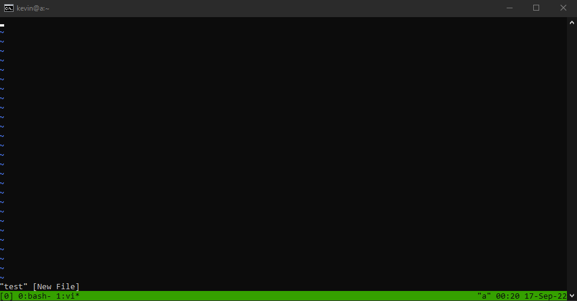](img/tmux2.png)

Notice the tab title changed from `1:bash` to `1:vi`. To exit vi, type
Esc :qa! That is: the Escape key, colon, q, a and ! (exclamation
point, aka the bang character).

```
:qa!
```

If you had used nano, instead, the tab title would have changed to
1:nano while nano was open.

In this tab, run a 'dnf update' or 'apt update'.

```
$ sudo dnf update
```

While running dnf update with sudo, the tab changes to 1:sudo.

[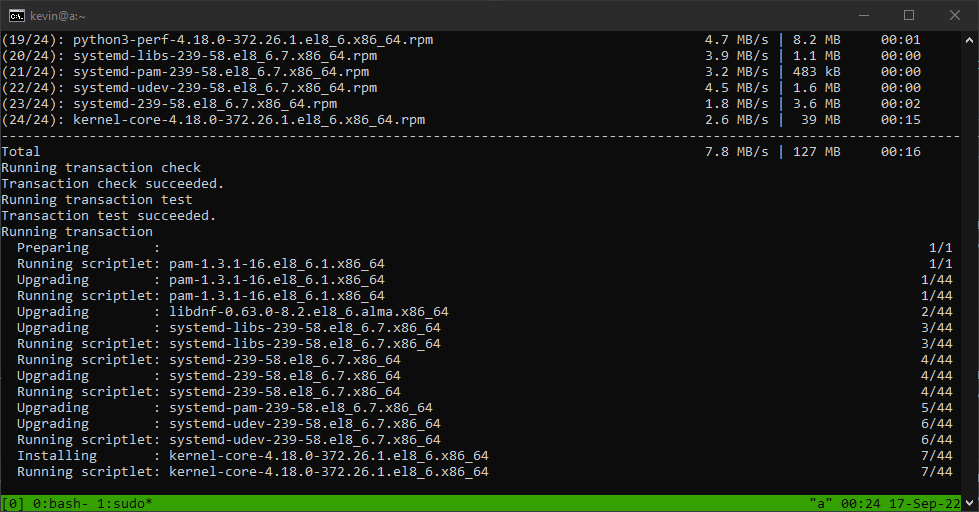](img/tmux3.png)

While that update is going, switch to the first tab with Ctrl-b n.

```
Ctrl-b n
```

Read the manpage for the ls command, for example.

```
$ man ls
```

[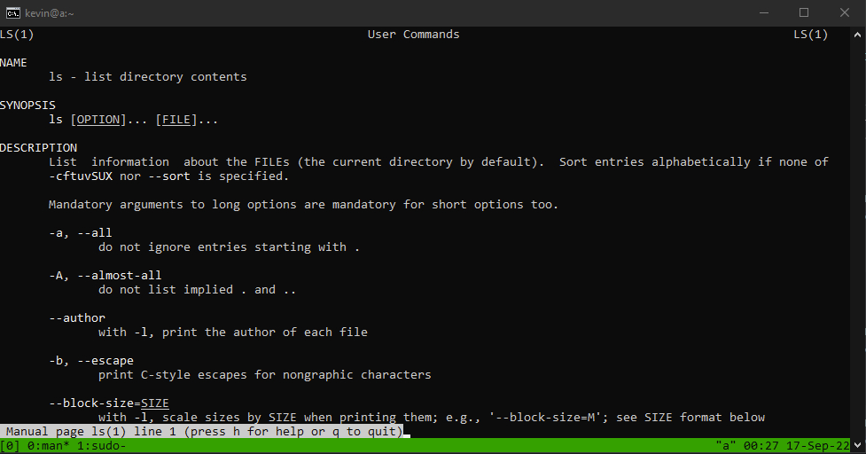](img/tmux4.png)

Now notice the first window (tab 0) has changed from 0:bash to 0:man,
because we're using the 'man' program to read the manual for the 'ls'
command. Notice also the asterisk (\*) is on the 0 window because
that's the one we're viewing.

You can close out of the ls manpage by typing q for quit. But don't do
that yet.

You can often tell when a command completes in the other window
without even switching to view it. For instance, once the 'dnf update'
finishes in the second tab '1:sudo', it'll change back to '1:bash'.

[](img/tmux5.png)

I don't know what that dash (-) means at the end of '1:bash-'. Check
the tmux manpage for more info.

Keep the ls manpage open and switch back to the second tab.

```
Ctrl-b n
```

[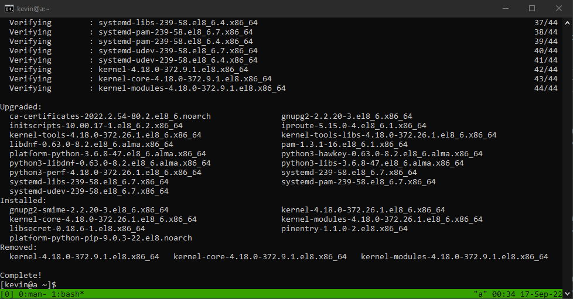](img/tmux6.png)

We switched back to the second tab, 1:bash, where we had run 'dnf
update'. We see that command has now completed.

Leave this tmux session the way it is for the next exercise.

#### Multiple sessions

Sessions in tmux are like whole web browser windows. Each can have its
own set of tabs.

For terminology in the tmux manpage: A web browser window is like a
tmux session. A browser tab is like a tmux window.

Detach your terminal (command prompt window) from this tmux session.

```
Ctrl-b d
```

[](img/tmux7.png)

Re-attach to the same session.

```
$ tmux a
```

[](img/tmux8.png)

Detach again.

```
Ctrl-b d
```

[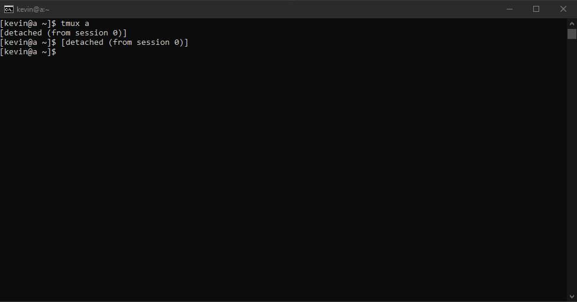](img/tmux9.png)

Now open a second tmux session.

```
$ tmux
```

[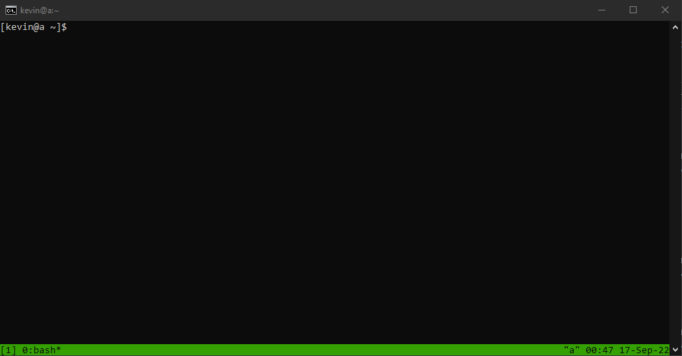](img/tmux10.png)

In the very left of the bottom green bar, our first tmux session was
titled \[0\]. This second tmux session is titled \[1\].

Detach from this second tmux session.

```
Ctrl-b d
```

[](img/tmux11.png)

If you try 'tmux a', it will attach to the most recently used session,
1 in this case, not 0.

```
$ tmux a
```

[](img/tmux12.png)

You can list your active sessions.

```
$ tmux list-sessions
```

Or you can abbreviate that partially.

```
$ tmux list-s
```

[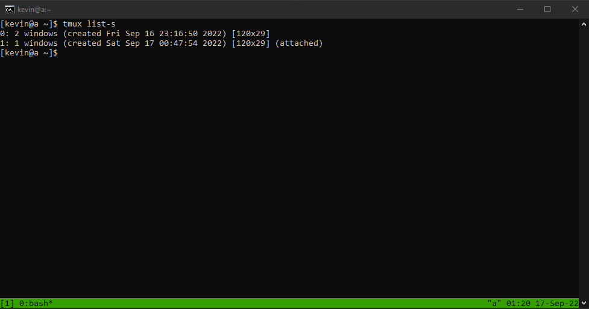](img/tmux13.png)

It shows us two sessions, 0 and 1. We are attached to session 1.

Session 0 is our original session where we have 2 windows (tabs). One
of them is showing the ls manpage. The other window in ran 'dnf
update' and finished. But this command output doesn't need to tell us
what was in those windows.

(You could rename the windows or a whole session if you want. But we
don't cover that here. Refer to the tmux manpage if you want to see
how.)

The easiest way to get back to the session you want is to only have
one session open.

To get back to session 0, exit this session 1.

```
$ exit
```

Now if you type 'tmux a', it'll attach to the original session,
because it's the only one open.

```
$ tmux a
```

[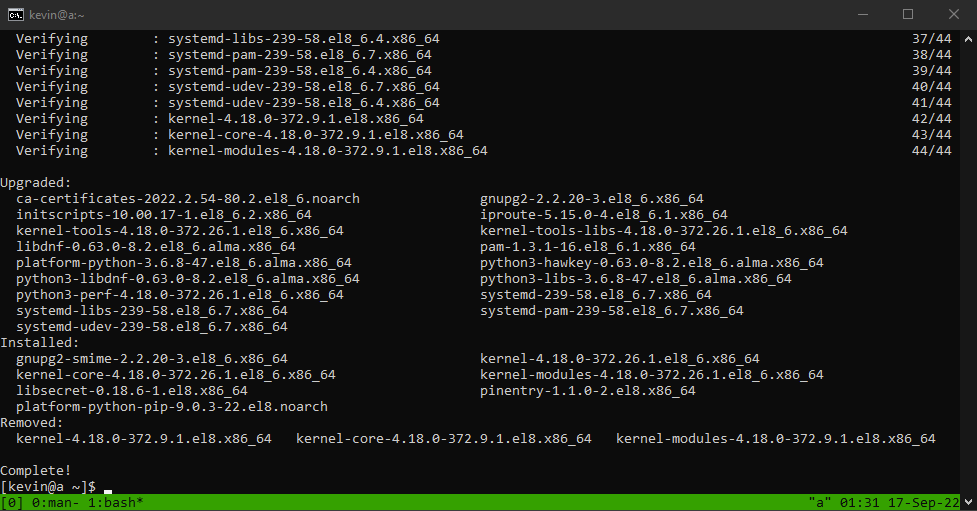](img/tmux14.png)

It's right where we left it, at the end of the 'dnf update' command we
ran earlier.

#### Split a window into multiple panes

tmux lets you compare multiple things side-by-side, or work on one
thing while watching another. To do this, you can split a tmux window
into multiple panes, just like a house window can have multiple window
panes.

Using our existing session 0 from above, split the window into top and
bottom panes with Ctrl-b " (double quote).

```
Ctrl-b "
```

[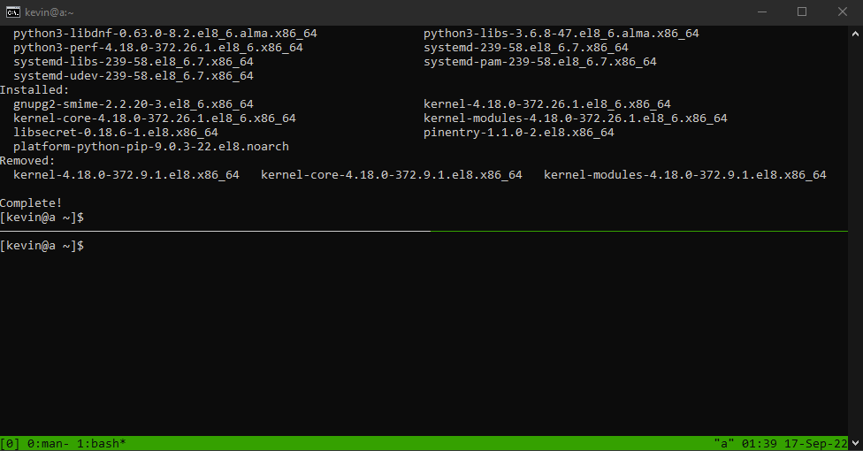](img/tmux15.png)

You can toggle/switch the cursor between the panes with Ctrl-b o.

```
Ctrl-b o
```

The screenshots don't show the cursor. But you get the point. Your
cursor should now be in the top pane, where 'dnf update' finished. Hit
Enter to make a new prompt line.

[](img/tmux16.png)

Switch back to the bottom pane with 'Ctrl-b o'.

```
Ctrl-b o
```

In a moment, we'll view a manpage in the bottom pane to demonstrate
using both panes at the same time. But first let's see how a manpage
looks inside tmux. Switch from window 1 to window 0, where we were
already viewing the ls manpage.

```
Ctrl-b n
```

[](img/tmux17.png)

The white status line at the bottom, above the green tmux bar, is part
of the man program. Exit the manpage now with q to quit.

```
q
```

[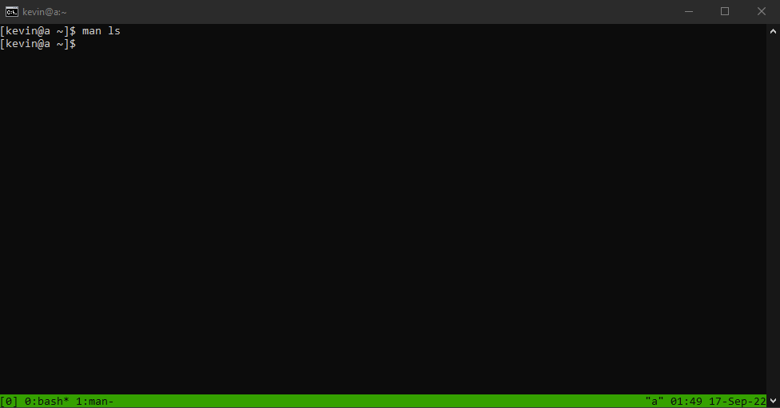](img/tmux18.png)

Switch from window 0 back to window 1.

```
Ctrl-b n
```

[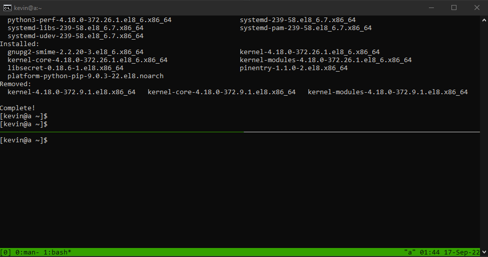](img/tmux19.png)

With the cursor in the bottom pane (use 'Ctrl-b o' to switch to it if
needed), open the pwd manpage.

```
$ man pwd
```

[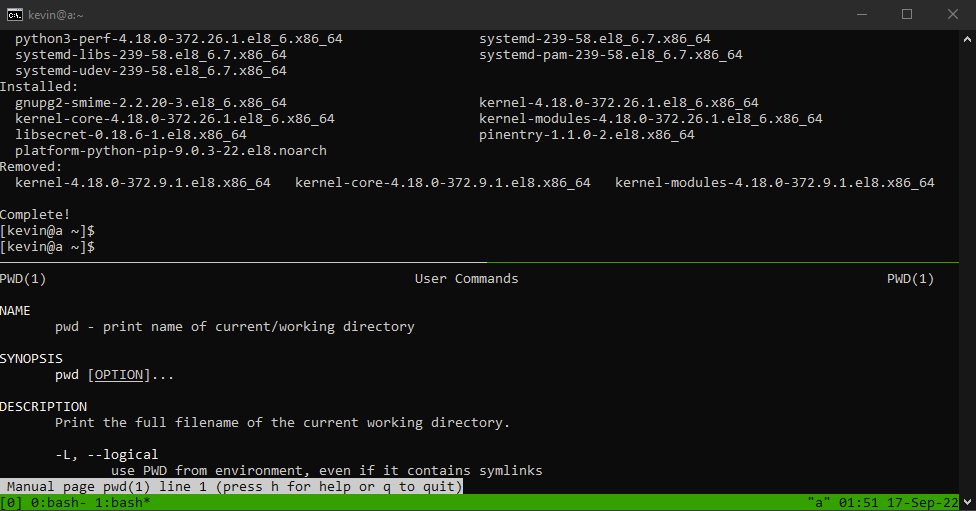](img/tmux20.png)

Experienced terminal users often prefer their command prompt views to
be as tall as possible, to show the most amount of lines and limit
scrolling back and forth.

tmux also lets you split a window into panes side-by-side rather than
top-and-bottom. You can split your current pane into side-by-side with
Ctrl-b % (percent sign, or Shift 5). We'll show that in the next
section.

Since our window 1 already has two panes open, let's re-arrange it
from top-to-bottom into side-by-side with Ctrl-b space (the spacebar
key).

```
Ctrl-b <space>
```

[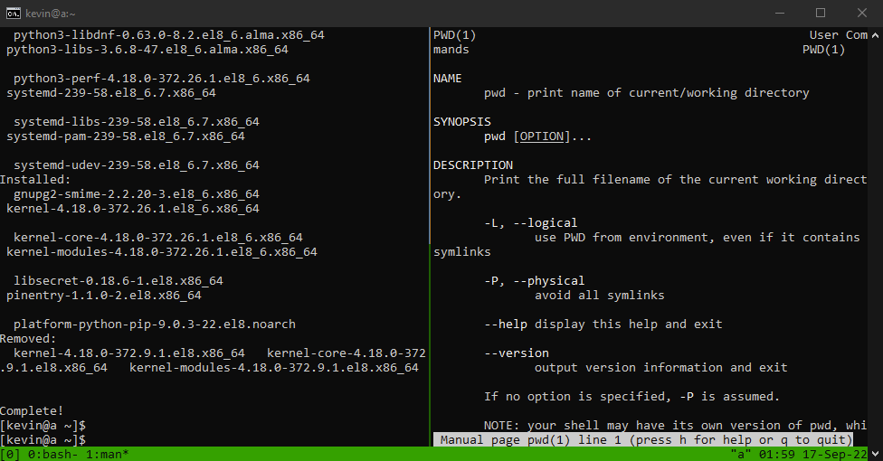](img/tmux21.png)

Your cursor should still be in the pane showing the pwd manpage, which
now on the right-hand side of window 1 in our example.

Scroll down the manpage one screenfull with the spacebar key.

```
<space>
```

[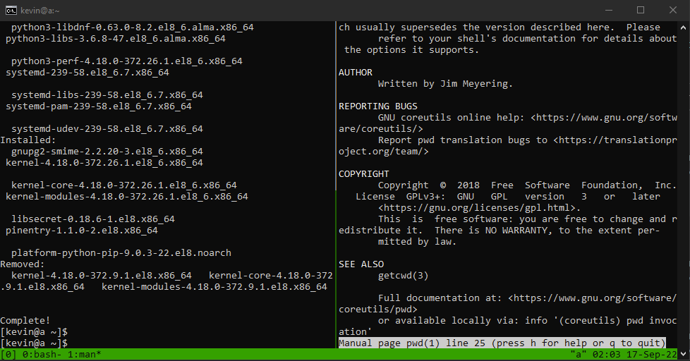](img/tmux22.png)

This manpage is a bit hard to read with its lines wrapped (cut off)
like that. Let's expand the command prompt window to be full screen.

[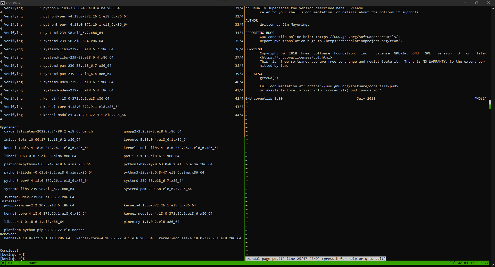](img/tmux23.png)

Now the spacing on the completed 'dnf update' command looks a bit off
too, because we ran the command earlier with the command prompt window
smaller. But that's okay. The next time we run any command in this
command prompt window, the output will be spaced correctly for the
current window size.

Quit the pwd manpage with q. Then open open the ls manpage, which is
long enough to fill this right-hand pane.

```
$ man ls
```

[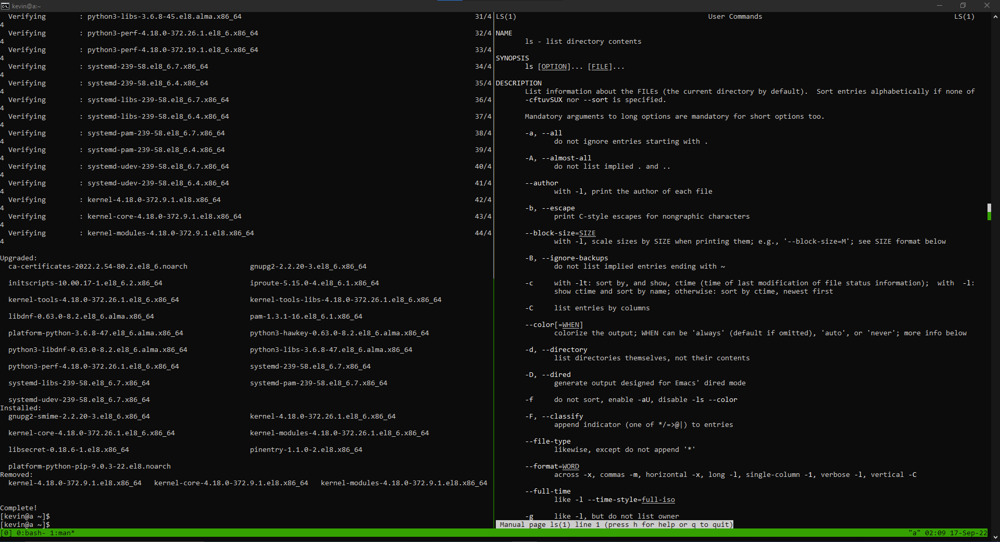](img/tmux24.png)

Switch over to the left-hand pane with Ctrl-b o.

```
Ctrl-b o
```

Print the current directory with pwd.

```
$ pwd
```

List the files and folders in this directory with details (-l),
including hidden files (-a), and in human readable file size numbers
(-h). You can combine them with -alh.

```
$ ls -alh
```

[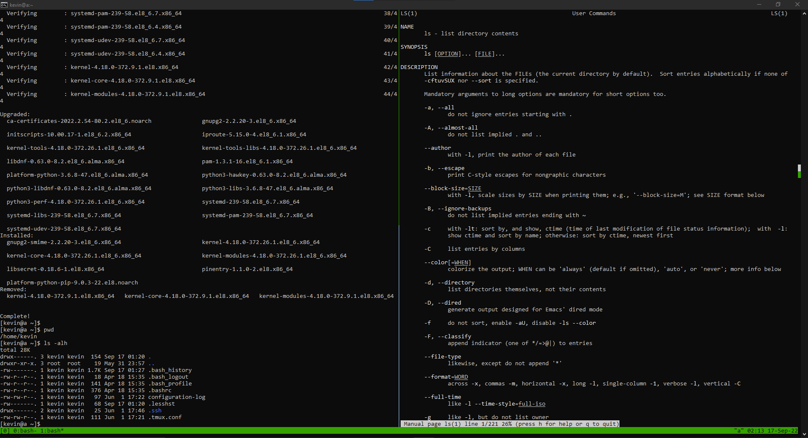](img/tmux25.png)

Notice there is a file called .tmux.conf. We use that to customize
tmux, such as changing the prefix key from the default Ctrl-b to
something easier to type and doesn't interfere with other
commands. See the Customization section below for details.

#### Split a window into three panes side-by-side

Following our example above, switch from window 1 to window 0.

```
Ctrl-b n
```

[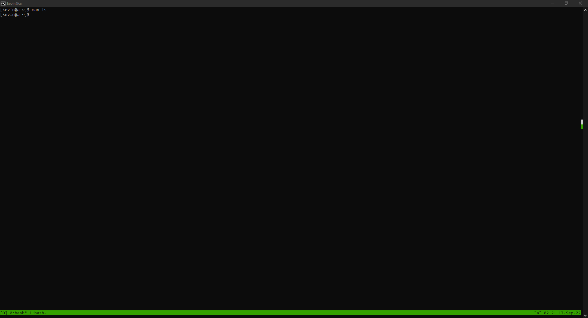](img/tmux26.png)

View the bash manpage.

```
$ man bash
```

[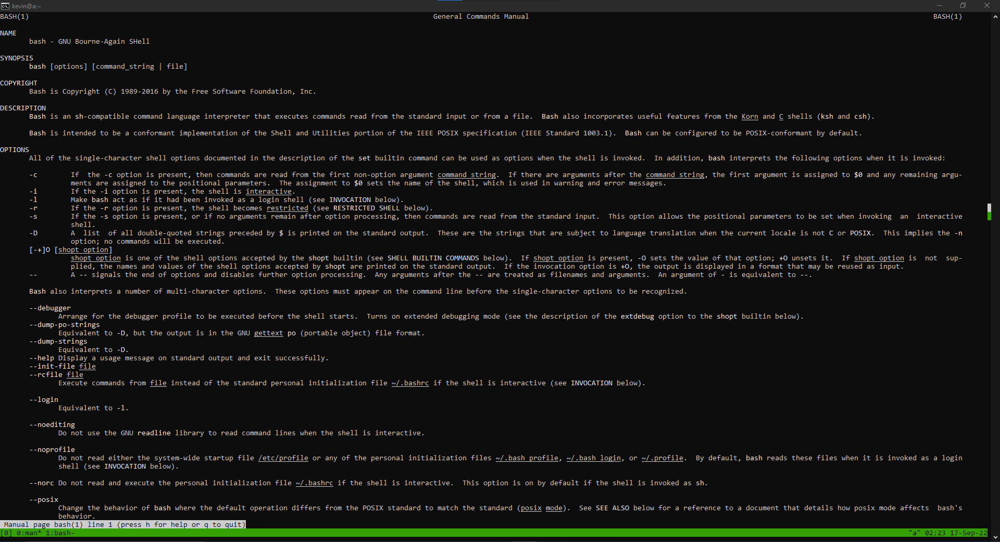](img/tmux27.png)

This is nice. But what if we wanted to look at three things at a time,
side-by-side?

Here's how:

For simplicity, exit the manpage first with q to quit.

```
q
```

[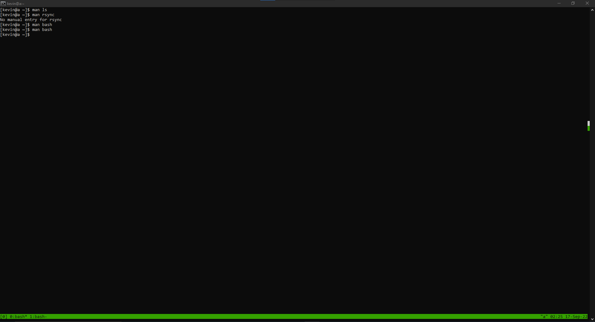](img/tmux28.png)

(Ignore the rsync command for now. I was just checking if it was
installed.)

Now hit Ctrl-b % twice to split the window in three panes,
side-by-side.

```
Ctrl-b % Ctrl-b %
```

[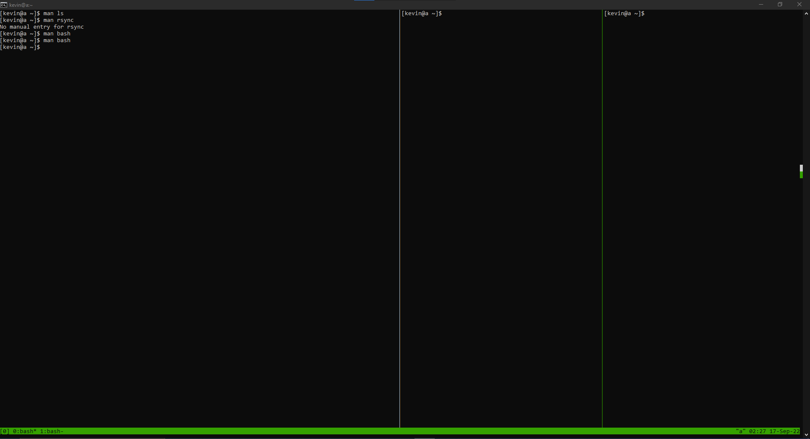](img/tmux29.png)

Before we do any commands in the panes, let's make the panes equal
size with Ctrl-b &lt;space&gt;.

```
Ctrl-b <space>
```

[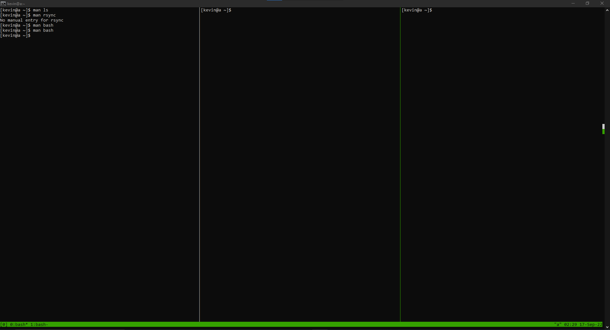](img/tmux30.png)

You can rotate among a set of built-in tmux pane arrangements by
repeating Ctrl-b &lt;space&gt; (like Alt-Tabbing through open Windows
in Windows 10).

```
Ctrl-b <space>
```

[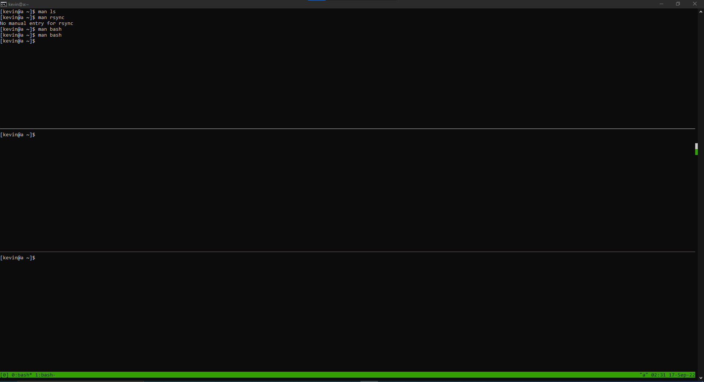](img/tmux31.png)

```
Ctrl-b <space>
```

[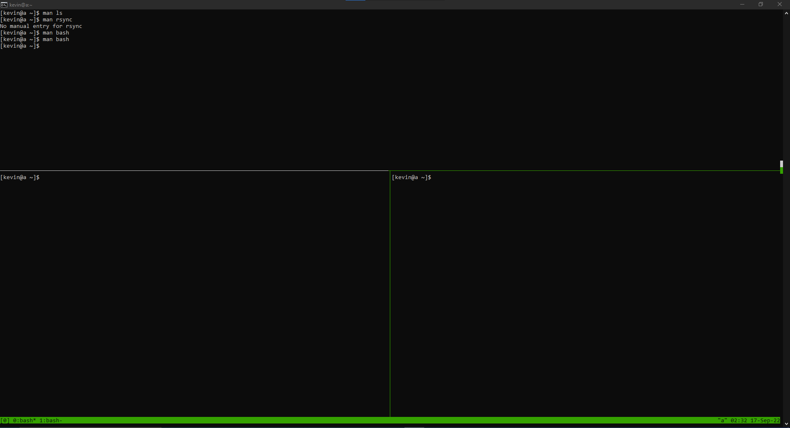](img/tmux32.png)

```
Ctrl-b <space>
```

[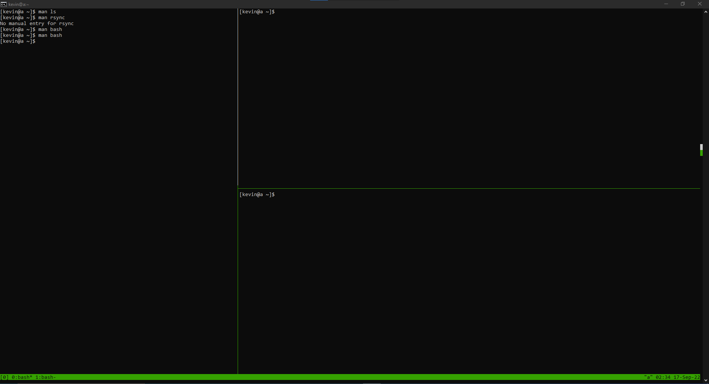](img/tmux33.png)

```
Ctrl-b <space>
```

[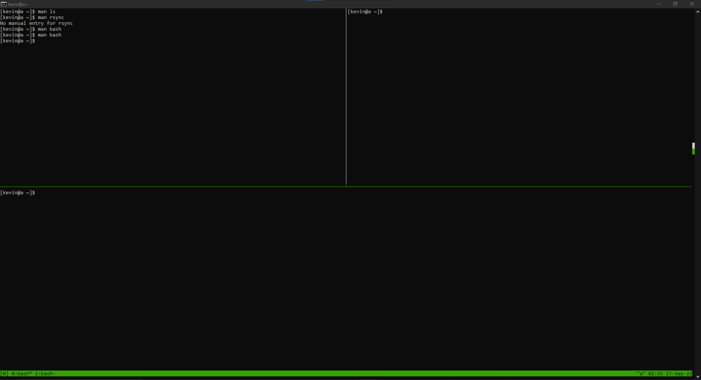](img/tmux34.png)

The next Ctrl-b takes us back to the original 3 column pane layout.

```
Ctrl-b <space>
```

[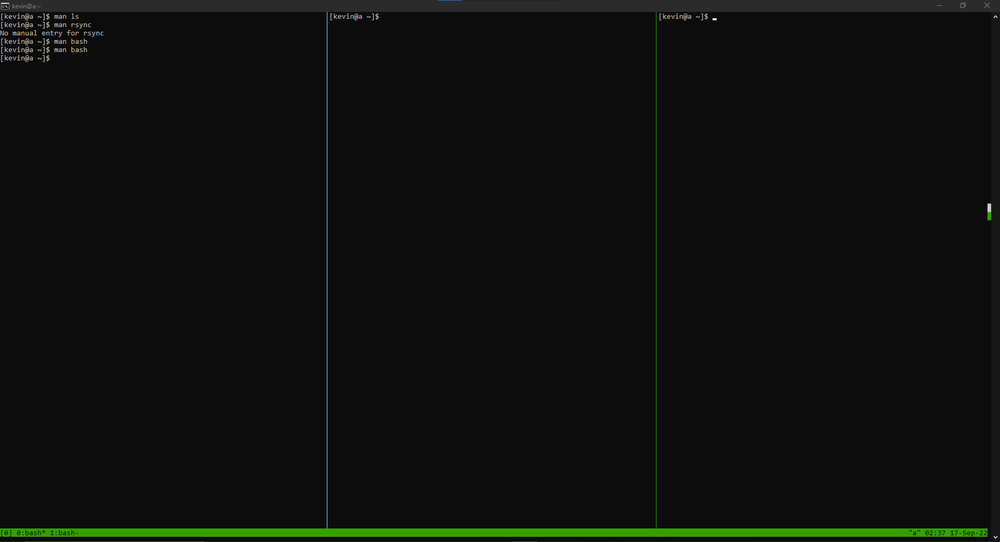](img/tmux35.png)

Finally, let's demonstrate them in use. Use Ctrl-b o to toggle between
the panes as needed.

```
Ctrl-b o
```

In the left pane, list the /etc directory.

```
$ ls /etc
```

In the middle pane, view the tmux manpage.

```
$ man tmux
```

Scroll down the manpage two screenfulls with the spacebar to the
default key bindings list.

In the right pane, search dnf for vim. List in dnf the emacs text
editor.

```
$ dnf search vim
$ dnf info emacs-nox
```

The resulting window should look like this.

[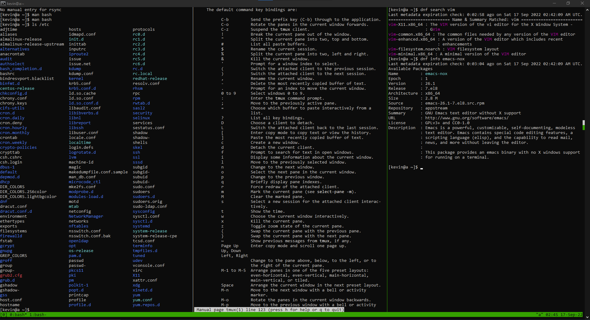](img/tmux36.png)

This arrangement can work well on vertical monitors too.

[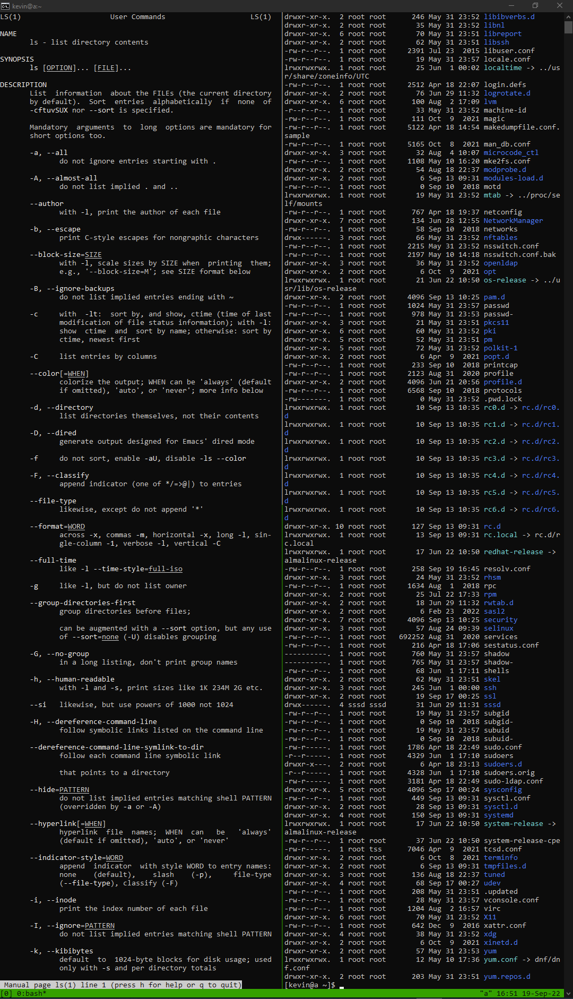](img/tmux37.png)

When it's time to log off the Linux server, you can save your place in
your work by detaching from the tmux session, then exiting the server
with 'exit' (as shown in the basic usage section above).

```
Ctrl-b d
```

```
$ exit
```

#### Customizing tmux behavior

Hitting Ctrl-b and then what you want can be cumbersome. It can save
you time to choose a single key instead of holding down Control,
hitting B, releasing both, then hitting D or whatever tmux command you
want.

One customization is to pick a different Prefix key for tmux. Instead
of Ctrl-B, how about ` (backtick, above the tab key)?

Make a new file in your home folder called .tmux.conf

The dot in front of the name is important. It will only show with ls
-a, not regular ls.

```
$ nano .tmux.conf
```

Add the following text to the file.

```
# Remap the prefix key from Ctrl-b to ` (backtick).

unbind-key C-b
set-option -g prefix `
bind-key ` send-prefix

```

Save and close the file. tmux won't detect the change for existing
sessions. So completely exit the current tmux session by typing 'exit'
in all tmux windows until the session is gone. Then start a new tmux
session. Now tmux commands will feel as fast as switching between
Windows apps with [Alt-Tab](https://en.wikipedia.org/wiki/Alt-Tab).

#### See also

[Tmux
Manpage](https://manpages.ubuntu.com/manpages/bionic/man1/tmux.1.html)

[Linode has a great guide on tmux, what it's for, and how to use
it](https://www.linode.com/docs/guides/persistent-terminal-sessions-with-tmux)
